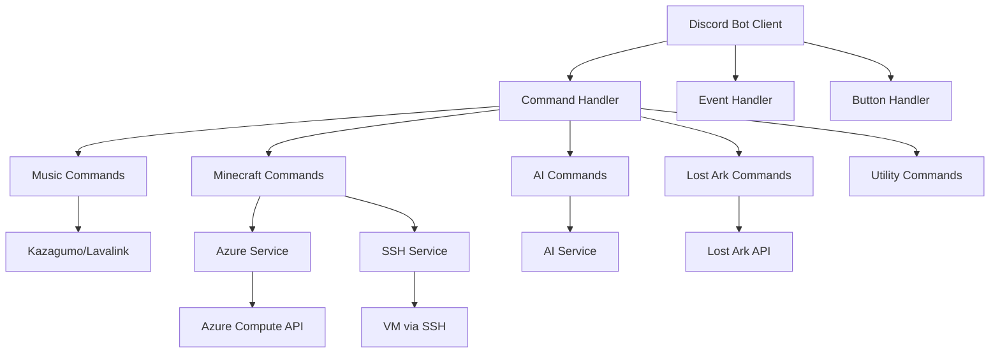

# Discord Bot - Bot Multi-Propósito Personal

Un bot de Discord completo construido con TypeScript y Discord.js v14, que integra reproducción de música, gestión de servidores Minecraft, capacidades de chat con IA, y consulta de personajes de Lost Ark.

## Características

### Reproductor de Música
- Reproducción de música de YouTube vía integración con Lavalink
- Gestión de colas (agregar, saltar, mezclar)
- Soporte para playlists
- Embeds enriquecidos con información de canciones y miniaturas
- Manejo de permisos de canales de voz

### Gestión de Servidores Minecraft
- Integración con Azure VM para control de servidores
- Iniciar/detener servidores Minecraft vía comandos de Discord
- Monitoreo de estado en tiempo real
- Gestión de servidores basada en SSH
- Control de acceso basado en roles y canales

### Chat con IA
- Conversaciones interactivas con IA dentro de Discord
- Respuestas conscientes del contexto

### Integración con Lost Ark
- Consulta de información de personajes
- Comandos de gestión de roster

### Comandos de Utilidad
- Comando ping para latencia del bot
- Transmisión de mensajes personalizados
- Utilidades de gestión de roles
- Endpoints de prueba de API

## Arquitectura



## Prerequisitos

- **Node.js** >= 22.11.0
- **npm** o **pnpm**
- **Discord Bot Token** (del Portal de Desarrolladores de Discord)
- **Servidor Lavalink** (para funcionalidad de música)
- **Cuenta Azure** (para gestión de servidor Minecraft)
- **Acceso SSH** a la VM destino (para gestión de Minecraft)

## Instalación

### 1. Clonar el repositorio

```bash
git clone <repository-url>
cd discord-bot
```

### 2. Instalar dependencias

```bash
npm install
```

### 3. Configurar variables de entorno

Copiar la plantilla y completar con tus credenciales:

```bash
cp .env.template .env
```

Editar `.env` con tu configuración:

```env
# Configuración de Discord
DISCORD_TOKEN=tu_token_de_discord_bot
ALLOWED_CHANNEL_ID=id_del_canal_para_comandos_minecraft
ALLOWED_ROLE_ID=id_del_rol_para_comandos_minecraft

# Configuración de Lavalink
LAVALINK_IP=ip_de_tu_servidor_lavalink
LAVALINK_PORT=2333
LAVALINK_PASSWORD=tu_contraseña_lavalink
LAVALINK_SECURE=false

# Credenciales de Azure (para gestión de servidor Minecraft)
AZURE_SUBSCRIPTION_ID=tu_azure_subscription_id
AZURE_TENANT_ID=tu_azure_tenant_id
AZURE_CLIENT_ID=tu_azure_client_id
AZURE_CLIENT_SECRET=tu_azure_client_secret

# Detalles de Azure VM
RESOURCE_GROUP=nombre_de_tu_resource_group
VM_NAME=nombre_de_tu_vm

# Configuración SSH
SSH_USER=tu_usuario_ssh
SSH_HOST=ip_publica_de_tu_vm

# Configuración del Servidor Minecraft
MINECRAFT_SERVICE_NAME=nombre_de_tu_servicio_minecraft
MINECRAFT_SCREEN_NAME=nombre_de_tu_sesion_screen
```

## Desarrollo

### Ejecutar en modo desarrollo

```bash
npm run dev
```

Esto usa `ts-node-dev` para recarga en caliente durante el desarrollo.

### Compilar el proyecto

```bash
npm run build
```

### Iniciar build de producción

```bash
npm start
```

## Despliegue con Docker

### Usando Docker Compose

```bash
docker-compose up -d
```

### Usando Dockerfile

Construir la imagen:
```bash
docker build -t discord-bot .
```

Ejecutar el contenedor:
```bash
docker run -d --env-file .env discord-bot
```

## Uso de Comandos

### Comandos de Música

- `/play <búsqueda>` - Reproducir una canción o playlist de YouTube
- `/pause` - Pausar reproducción actual
- `/skip` - Saltar a la siguiente canción en la cola
- `/queue` - Mostrar cola actual
- `/shuffle` - Mezclar la cola
- `/disconnect` - Desconectar el bot del canal de voz

### Comandos de Minecraft

- `/start` - Iniciar el servidor Minecraft (requiere rol y canal específicos)
- `/stop` - Detener el servidor Minecraft

### Comandos de IA

- `/chat <mensaje>` - Chatear con IA

### Comandos de Lost Ark

- `/character <nombre>` - Consultar información de personaje
- `/roster <nombre>` - Ver información de roster

### Comandos de Utilidad

- `/ping` - Verificar latencia del bot
- `/say <mensaje>` - Hacer que el bot diga algo
- `/api` - Probar endpoint de API

## Stack Tecnológico

### Core
- **TypeScript** - JavaScript con tipado seguro
- **Discord.js v14** - Wrapper de la API de Discord
- **Node.js** - Entorno de ejecución

### Música
- **Kazagumo** - Framework avanzado de reproductor de música
- **Shoukaku** - Wrapper de Lavalink para Discord.js
- **Lavalink** - Servidor de entrega de audio

### Cloud e Infraestructura
- **Azure SDK** - Gestión de Azure Compute
- **@azure/identity** - Autenticación de Azure
- **@azure/arm-compute** - Control de VMs de Azure

### Utilidades
- **dotenv** - Gestión de variables de entorno
- **env-var** - Variables de entorno con tipado seguro
- **ssh2** - Cliente SSH para gestión de VMs

### Desarrollo
- **ts-node-dev** - Servidor de desarrollo con recarga en caliente
- **rimraf** - Eliminación de archivos multiplataforma

## Estructura del Proyecto

```
discord-bot/
├── src/
│   ├── app.ts              # Punto de entrada principal
│   ├── commands/           # Slash commands
│   │   ├── ai/            # Comandos relacionados con IA
│   │   ├── client/        # Comandos de utilidad del bot
│   │   ├── guild/         # Comandos de gestión de servidor
│   │   ├── lostark/       # Integración con Lost Ark
│   │   ├── minecraft/     # Comandos de servidor Minecraft
│   │   ├── music/         # Comandos de reproductor de música
│   │   └── utils/         # Comandos de utilidad
│   ├── events/            # Manejadores de eventos de Discord
│   ├── handlers/          # Manejadores de comandos, eventos, botones
│   ├── buttons/           # Manejadores de interacciones de botones
│   ├── services/          # Integraciones de servicios externos
│   ├── lib/               # Bibliotecas auxiliares y utilidades
│   ├── interfaces/        # Interfaces de TypeScript
│   ├── config/            # Archivos de configuración
│   └── embeds/            # Plantillas de embeds reutilizables
├── docs/                  # Plantillas de documentación
├── .env.template          # Plantilla de variables de entorno
├── Dockerfile             # Configuración de contenedor Docker
├── docker-compose.yml     # Configuración de Docker Compose
├── tsconfig.json          # Configuración de TypeScript
└── package.json           # Dependencias del proyecto
```

## Notas de Seguridad

- Nunca commitees tu archivo `.env`
- Mantén tu token de Discord y credenciales de Azure seguras
- Usa variables de entorno para todos los datos sensibles
- Implementa control de acceso basado en roles apropiado para comandos críticos

## Contribuir

1. Hacer fork del repositorio
2. Crear una rama de feature (`git checkout -b feature/caracteristica-increible`)
3. Commitear tus cambios (`git commit -m 'Agregar característica increíble'`)
4. Push a la rama (`git push origin feature/caracteristica-increible`)
5. Abrir un Pull Request

## Licencia

Este proyecto está licenciado bajo la Licencia ISC.

## Solución de Problemas

### El bot no responde a comandos
- Asegúrate de que el bot tenga los permisos apropiados en tu servidor de Discord
- Verifica que el token del bot sea correcto en `.env`
- Verifica que el bot esté en línea en Discord

### Los comandos de música no funcionan
- Confirma que el servidor Lavalink esté ejecutándose y accesible
- Verifica las credenciales de Lavalink en `.env`
- Asegúrate de que el bot tenga permiso para unirse a canales de voz

### Los comandos de Minecraft fallan
- Verifica que las credenciales de Azure sean correctas
- Verifica la conectividad SSH a la VM
- Asegúrate de que los IDs de rol y canal especificados sean correctos

### Errores de compilación
- Elimina `node_modules` y `package-lock.json`
- Ejecuta `npm install` de nuevo
- Asegúrate de estar usando Node.js >= 22.11.0

## Soporte

Para problemas y preguntas, por favor abre un issue en el repositorio.
